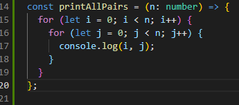
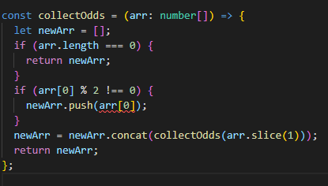

# algo-data-notes

A simple repo where I can store my notes on algorithms, data structures, bigO notation and examples.

# Big O Notation

PSA: I like to take my notes as if I was explaining the concept to someone.

WHAT IS LOG
log10(1000) pretty much this reads 10 to what power will equal 1000?

## ---------------------------Why is big O notation important?---------------------------

- There are so many solutions for solving an algorithm, how do we know which one is the best? This is where Big O comes in.
- Take for example given the problem "write a function that accepts a string input and returns a reversed copy" you could use a variety of solutions for this, we would we use Big O notation to understand which is the best
- Keep in mind that the way Big O ranks how well a solution performs is not as straight forwrd as "worst - best" its more of a numeric approach.
- You may ask, why worry about the best solution if my code works? If it works, it works.
  - Its important to have precise vocabulary to talk about how our code performs.
  - Useful for discussing trade offs between different approaches.
  - Help understand what parts of our code that could be slowing it down.

### Example

-Write a function that calculates the sum of all number from 1 up to n

-Solution One

-Solution Two

- Here we have two working solutions so which one is better?
- Do we look at which is faster? Which uses less memory? Which is more readable? They are all valid concerns and it comes down to the situation.
- Idealy we would focus on speed and memory usage first.

- When testing the speed on both solutions, soluton 1 takes around 1.25 seconds to run while solution 2 takes .0001 seconds to run. A huge difference.
- The only problem is that when it comes to timing our code there is alot of problems with time in general
  - Different machines will record different times
  - The SAME machine will record different times
  - For algorithms where the solution is relatively fast for all solutions, speed measurements may not be precise enough.
- But how would we write down how effecient these solutions are in comparison?
  - Instead of measuring time, we would instead count the NUMBER of simple operations the computer has to perform.
  - This remains constant compared to measuring time.
- if we look at solution 2 we can see three operations happening.
  - 1 multiplication
  - 1 addition
  - 1 division

- If we use the same approach for solution one we will see x operations
  - since we are in a loop here the amount of operations is dependant on n.
  - within the loop we have n additions and n assignments (+=)
  - we have n additions and n assignments for incrementing i (i++)
  - 1 assignment for total variable, 1 assignment for i variable, n comparisons for i to n (i<= n)

- Dont get bogged down on counting all the operations and assignments, what we are concerned about here is how our operations grow roughly in proportion with n. It is a trend. Focus on the big picture.

## ---------------------------So what exactly is Big O?---------------------------

- Think of it as fuzzy counting, it allows us to talk in a formal manner about how the runtime of an algorithm grows as the inputs grow.

  - we only care about the trends
  - we are also talking about the worst case scenario when it comes to a solution

- This graph is a great visual representation of different types of O notation, some have yet to be covered

- We say that an algorithm is O(f(n)) if the number of simple operations the computer has to perform is eventually less than a constant times f(n), as n increases. f = function & n = input
- if we take our previous examples
  - Example two always has 3 operations, its constant. It would have a runtime of O(1)

- If we look at example one
  - The number of operations is bounded by a multiple of n. It would have a runtime of O(n)

- Now if we look at the example of this function we notice that O(n) operation for the first for loop has another O(n) operation inside of it as another for loop so it would have a runtime of O(n^2) <=== squared. The algo grows roughly at the rate of n squared

## ---------------------------Rules for Big O---------------------------

- Constants dont matter
  - if we have something like O(2n) this becomes O(n). If we have O(500) this becomes (1). O(13n2) becomes O(n^2) <=== squared
- Smaller terms dont matter
  - If we have something like O(n + 10) this becomes O(n)
  - If we have O(n^2 + 5n + 8) this becomes O(n^2). Look at the big picture if n = 1000; 1000 squared is 1 mil, but 5\*1000 + 8 is 5008. The difference between the two is so small there is no point in worrying about the 5n + 8, its meaningless.
- Arithmetic operations are constant
- Variable assignment is constant
- Accesing elements in an array or object is constant
- in a loop the compelxity is the length of the loop times the complexity of whatever happens inside the loop

## ---------------------------Logarithms---------------------------

- Some of the most common runtime complexities youll encounter is O(1), O(n), and O(n^2)
- You will encounter big O expressions that involve more complex mathematical expressions
  - One of these being the logarithm such as O(logn)
- If you have a runtime complexity of O(log n) thats great! Very similar to O(1)
- It is helpful to understand what logarithms are but at the end of the day the math isnt as important because we are always focusing on the trend
  - the point is to be able to look at an algorithm and say "Oh this algo has a runtime of O(n)"
- Why logathrims are importnt
  - Certain searching algorithms have a logarithmic time complexity
  - Efficient sorting algorithms involve logarithms
  - Recursion sometimes involves logarithim space complexity

## ---------------------------Analyzing performance of Arrays and Objects---------------------------

- We can understand how objects and arrays work through the lens of Big O

### Objects

- Objects are great when you dont need order and want fast access / insertion and removal
- runtime complexity for
  - accessing an object: O(1)
  - adding to an object: O(1)
  - removing from an object: O(1)

### Arrays

- Arrays are ordered unlike an object
- Should only really use them when you need order, and fast access for insertion and removal
- Accessing an array is O(1) its constant Ex. arr[0] / arr[9000]
- Insertion / Removal
  - Adding an element to the end of array with .push() is O(1)
  - Adding an element to the beginning of an array requires all indecis to update which is O(n)
    - Same goes for removing from the beginning
- Searching is O(n) as the number of items in a array grows the amount of time grows to search through the array

- There are some built in array methods
  - push(): O(1)
  - pop(): O(1)
  - shift(): O(n)
  - unshift(): O(n)
  - concat(): O(n)
  - slice(): O(n)
  - splice(): O(n)
  - sort(): O(n \* log n)
  - forEach(), map(), filter(), reduce(), etc..: O(n)

## ---------------------------Algorithms and Problem Solving Patterns---------------------------

- OBJECTIVE
  - understand what an algorithm is
  - how to devise a plan to solve algorithms, even ones we are unfamiliar with
  - compare and contrast problem solving patterns

### What is an Algorithm?

- A proccess or set of steps to accomplish a certain task.
- Why is this important
  - almost everything you do in programming involves some form of an algorithm
  - understanding algorithms is the foundaiton for being a successful problem solver and developer
  - and of course they come up in interviews
- How do you improve?
  - Devise a plan for solving problems, how do you approach a problem and break it down?
  - Master common problem solving patterns

### Problem solving strategies

- Understand the problem

  - Don't rush into typing out your code, take a step back and analyze the problem
  - Ask these questions:
    - Can I restate the problem in my own words?
    - What are the inputs that go into the problem?
    - What are the outputs that should come from the solution to the problem?
    - Can the outputs be determined from the inputs?
    - How should I label the important pieces of data? What are the pieces that matter?

- Exploring Examples

  - Coming up with examples can help you understand the problem better
    - User Stories
    - Unit Test
    - explore simple examples, examples with empty inputs, invalid inputs

- Break it down

  - Write out the steps you need to take, just the basic components. This makes you think about your code before you write it and helps you catch or figure out any parts you might not understand
  - Remember that in an interview setting a lot of the time you will be given probelms that you aren't expected to solve within the given time, they are more concerened about how you approach solving problems.

- Solve / Simplify

  - Solve the problem if you can, and if you cant solve a simpler problem. Try to ignore the parts giving you a hard time so you can focus on everything else
  - After creating a simplified solution try to incorporate the difficult part

- Look Back and Refactor

  - Once you have a solution its tempting to leave the problem at that, if it works it works right?
  - It's important to try and improve your code, take the time to reflect on it. What do you not like about it?
    - is it easy to read and understand?
    - can you imrpove the performance of your solution?
    - can you thikn of ways to refactor?
    - how have other people solved this problem
  - There is rarely only one solution to solving a problem

### Problem Solving Patterns

- Common Patterns

  - Frequency Counter
  - Multiple Pointers
  - Sliding Window
  - Divide and Conquer
  - Dynamic Prgramming
  - Greedy Algo
  - Back Tracking

- Frequency Counter

  - This pattern uses objects or sets to collect values and their frequency
  - this is helpful for avoiding nested loops
  - Ex. Write a function called same which accepts two arrays. The function should return true if every value in the array has its coresponding value squared in the second array.
  - In short you can break down two arrays and store there values in seperate objects and compare

  - The approach seen below would have a complexity of O(n^2) due the fact that we have a nested loop(indexOf) within a forloop.

  

  - If we use the frequency counter approach our solution would something like the following:

  

  - we create two seperate frequency counters and initilize them as empty objects, storing the values from each array inside the object with how many times they occur.
  - if our inputs for the function were two arrays such as [1,2,2,3] and [1,4,4,9] our objects would look like
    - frequencyCounter1 = {1:1, 2:2, 3:1}
    - frequencyCounter2 = {1:1, 4:2, 9:1}
  - We can then compare the objects to see if the key values match
  - This approach would have a complexity of O(n) which is an improvment over O(n^2)
    - with the O(n^2) approach if our arrays had a length of 1000, since we have a nested loop that would be 1 million iterations
    - with the O(n) approach we have 3 seperate loops so if the array was a length of 1000 there would only be 3000 iterations

- Multiple Pointers

  - Creating pointers or values that correspond to an index or position and move towards the beginning, end or middle based on a certain condition
  - Very efficient for solving problems with minimal space complexity
  - Ex. write a function called sumZero which accepts a sorted array of integers. The funciton should find the first pair where the sum is 0. Return an array that includes both values that sum to zero or undefined if a pair does not exist.
  - The first solution that might come to mind could be nesting a for loop within a for loop, but as we know this would be a complexity of O(n^2) which is not ideal

  

  - For this example we know that are input of numbers is going to be in order which is necessary for using pointers.
  - We will set a pointer at the beginning of the array, the smallest number, and a pointer at the end of the array, the largest number.
  - If the sum is greater than 0 we will move the right pointer down 1, and if its less than 0 we will move the left pointer up 1. This is why its important to know that our array is sorted.
  - This solution will have a complexity of O(n) much better than O(n^2)

  

- Sliding Window Pattern

  - This pattern involves creating a window which can either be an array or number from one position to another
  - Depending on a certain condition, the window either increases or closes
  - very useful for keeping track of a subset of data in an array/string etc.
  - for example say given an array you wanted to calculate the maximum sum of 2 consecutive numbers, you could make a window and move the window across the array depending on the condition.

  

  - The problem with the solution seen above is the nested loop, leading to a complexity of O(n^2). If our array was extremely large and we were looking for the max sum of 100,000 digits this would be extremely inefficient.
  - If we were to refacor the solution and incorporate the sliding window, it would look something like this.

  

  - This solution allows up to loop over the array one time. We do this by storing the initial value of the summed digits and instead of repeating the process over and over we instead subtract the first number and add the new number. This solution would have a complexity of O(n)

- Divide and Conquer

  - This pattern involves dividing a data set into smaller chunks and then repeating a process with a subset of data. (Think of the phonebook example from CS50)
  - This pattern can greatly decrease time complexity.
  - Ex. Given a sorted array of integers, write a function called searh that accepts a value and returns the index of where that value is found.
  - In the solution below, we loop over the array until we find the number in the array that matches the given value, giving us a complexity of O(n), which is not terrible, but it could be better!

  

  - If we were to refactor our solution to use the divide and conquer method, in this case a binary search, it would look something like the following:

  

  - We start in the middle of the array and check if the number we are on is less then or greater then the value we are searching for and move in accordance.
  - This has a complexity of Log(n)
  - Keep in mind for this method to work our array must be sorted.

## ---------------------------Recursion---------------------------

- Recursion is another way to think about writing a solution.
- To help understand recursion, we shall tell a story:
  - Once upon a time there was a little boy named Martin, this was during a time where computers didnt exist and instead we had wizards. Martin was training with the wizards and out in the world there was also an angry dragon. The wizard gave martin a task to talk to the dragon, he gave Martin a list of numbers and wanted Martin to find out if any of the numbers on the list were odd numbers, a task only the dragon could complete.
  - So Martin approached the dragon and said
    > "Excuse me Mr.Dragon, are any of these numbers odd? (3142, 5798, 6550, 5914)"
  - The dragon, being a dragon, is not in a good mood, and says
    > "Sorry boy, ill only tell you if the first number in that list is odd"
  - Martin replies
    > "BUT I NEED TO KNOW IF ANY OF THE NUMBERS IN THE LIST ARE ODD NOT JUST THE FIRST"
  - The dragon remains firm and stands his ground. So martin think a bit an what he could do and comes up with a solution. Being the clever apprentice to the wizard Martin approaches the dragon and says
    > "Alright is this number odd?" (3142, 5798, 6550, 5914)
  - Martin gives the dragon the original list. The dragon looks at the first number in the list and gives his answer. Martin then returns and says
    > "Okay is this number odd?"
  - He gives the dragon the follow list (5798, 6550, 5914) and repeats this process until going through all the numbers individually, through this process he discovers that none of the numbers are odd.
  - Feeling triumphant Martin exclaims to the dragon
    > "AHA so you're saying none of the numbers in the original list are odd!"
  - The dragon tilts his head to the side with a curious look on his face and replies
    > "Ah, I see my boy. So you've dicovered recursion?"

### So why use recursion?

- Recursion: A process that calls itself, in our case, a function.
- It occurs everywhere, all the time. If you've been writing javascript you've probably been using recursion
  - JSON.parse / JSON.stringify.
  - document.getElementById/querySelector and dom traversal algorithms.
  - Object Traversal
  - We will see it with more complex data structures.

### Lets talk about the call stack

- What happens behind the scenes when a recusive function is called over and over again?
- In almost all program languages there is a built in data structure that mangages what happens when functions are invoked. The call stack
- When a function is invoked its placed on top of the call stack, when the function ends the compiler will remove the function from the top.
- When working with recursion functions you'll be working with the call stack a lot.

### How Recursive functions work

- Invoke the same function with a different input until you reach your base case.
- The base case is the condition when the recursion ends. THIS IS THE MOST IMPORTANT PART TO UNDERSTAND
- Overall there is two essential parts of a recursive function
  - the Base Case
  - and having different inputs (think of the list from the dragon story)
- The function below, countdown, is an example of a recursive function

- Basically we are looping, but using recursion to demonstrate the concept.
- We do not reach our base case until num is <= 0, if our number does not meet this condition we subtract 1 from our number and run countdown with the new number.

- Here is another example of recursion

- here our base case is one, if num === 1 we return 1.

### Common Recursion pitfalls

- No Base Case, or base case is wrong. Without a base case your code could continually run. Infinite loop bad >:(
- Forgetting to return or returning the wrong thing.
- Running into a stack overflow, to many functions being run in the callstack.

### Helper Method Recursion

- A design pattern commonly used with recursion.
- Look at is a helper that we have within our function.
- For example maybe we need to store the value of something such as: given a list of numbers return an array of all odd numbers.
- we could define a variable of arr which equals an empty array and push the odd numbers into the array. However if we have a recursive function, its going to run multible times meaning our variable for the array will always be reset back to an empty array instead of storing our values seeing that the empty array is its initial value.
- To fix this we could create a seperate function within our main function that performs the recursion, and keep are array outside. This is our helper.
- If we incorporate the helper method our function would like something like this:

### Pure Recursion

- The function itself is self contained, there is no nested function.
- I honestly am having trouble wrapping my brain around this to, so uh try your bestt :)

- Pure recursion tips

  - For arrays, use methods like slice, the spread operator, and concat that make copies of arrays so you do not mutate them
  - Remember that strings are immutable so you will need to use methods like slice, substr, or substring to make copies of strings
  - to make copies of objects use Object.assign or the spread operator

## ---------------------------Searching Algorithms---------------------------

- OBJECTIVES
  - implement linear search on arrays
  - implement binary search on sorted arrays
  - implment a naive string searching algo
  - implement the kmp string searching algo

### Linear search

- The simplest way to search through an array for a specific item is to search through it from the beginning until you find the item you're looking for
- This approach would be a linear search
- JavaScript has some built in methods for this
  - indexOf
  - includes
  - find
  - findIndex
- Example. Given an array of numebrs and a target value return the index of the target value within the array.

- This would have a time complexity of O(n)
  - The best case for time complexity would be O(1) we find our thing right away, this is rare though
  - The worst case is O(n) our complexity is dependent on the length of the array in this case
  - However average is also O(n)

### Binary search

- Binary is much faster form of searching (Think of the phonebook example form CS50)
- rather than eliminating one element at a time, in binary search we can eliminate halfo f the remaining elemetns at a time
- Keep in mind binary search only works on sorted arrays
- We divide and conquer, we split our array into two pieces

- In the solution seen above, we create three pointer, one for the beginning of the array (left) one for the end of the array (right) and one for the middle of the array (middle)
- We then create a while loop with two conditions
  - the first being to continue looping if the middle value does not equal our target value seeing that is our goal.
  - the second is a safety net incase our value is not in our array. If at any point left is greater than right we will exit the loop to prevent an infinite loop.
- From there we simply check if our target value is greater than or less than our middle value and adjust our pointers accordingly
- Rememeber this only works if your array is sorted!
- this approach would have an approach of O(log N)

## ---------------------------Sorting Algorithms---------------------------

- BIG BOY STUFF
- This is an important topic, a great challenge, and something you'll do all the time as a developer but don't be intimidated!
- For now we will focus on arrays and numbers
- Examples
  - sort numbers from smallest to largest
  - sorting names alphabetically
  - sorting movies based on release year
  - soring movies based on revenue
- There is so many ways to sort, some better than others, some that are neich and are usually terrible in most scenerios except in specific situations.
- The following link is a great video demonstrating different sorting algorithms visually
  - https://www.youtube.com/watch?v=kPRA0W1kECg&ab_channel=TimoBingmann
- Most commonly used sort algorithms
  - Insertion
  - Selection
  - Bubble
  - Shell
  - Merge
  - Heap
  - Quick

### Why learn this?

- Sorting is so common in programming, yes there is built in sort methods for js but its important to understand what algorithm it's using behind the scenes and alternative options
- There are many ways to sort and different techniques have their own advantages and disadvantages
- Also a classic interview topic :)

### Bubble Sort

- Not very commonly used, but its good to understand and helps us understand future approaches
- Its called bubble sort because when sorting an array the larger values will bubble up to the top
- we compare two values in the array and whichever is larger is swapped forward

### Selection Sort

- Similar to bubble sort, but instead of first placing large values into sorted position, selection sort places small values into sorted position.
- We search through the array for the smallest value and move it to the front of the array

### Insertion Sort

- Builds up the sort by gradually creating a larger half which is always sorted

### Comparing bubble, insertion, and selection sort

- Bubble and insertion sort perform extremlly well on nearly sorted data
- time complexity for these will be O(n^2)
- space complexity will be O(1)
- Very slow with large datasets
- at the end of the day they are all pretty equivalent in performance

## ---------------------------Intermediate Sorting Algorithms---------------------------

- Don't be scared if you dont understand the concepts so far! If you are not understanding the basic sorting methods and have trouble writing the code on your own and understanding it, thats so normal! Keep going!
- The following sorting algorithms we will be learning about will be more of an intermediate level but they are faster compared to previous methods we just worked with.
- Improve our time complexity from O(n^2) to O(n log n) which is pretty good compared to O(n^2)
- trade off between efficiency and simplicity
- Take longer to understand but worth it

### Merge Sort

- Combination of merging and sorting
- exploits the fact that rrays of 0 or 1 element are always sorted
- works by decomposing an array into smaller arrays of 0 or 1 elements, then building up a newly sorted array
- Once we break down the array into single element arrays we can then compare the arrays and sort them accordingly.
- As we begin to rebuild the array, the newly built arrays will already sorted making the process that much easier.
- Keep in mind that merge sort uses Recursion!
- This can be a tough one to understand at first, my advice:
  - Go through every single line of code and try to understand what the code is doing, try to visualize how the array is being manipulated
  - This can take some time, I know it did for me, if your spending 10-20 minutes trying to understand a single line of code thats okay! Take your time and embrace the challenge :)

- Merge sort has a time complexity of O(n log n)

### Quick Sort

- Like merge sort, quick sort exploits the fact that arrays of 0 or 1 elements are already sorted
- works be selecting a single element(pivot point) and find the index where the pivot should end up in the sorted array
- In other words we select a number in the array, any numbers less than the selected number will move to the left of it while everything else to the right
  - Because of this we know that pivot number is in the correct spot
- we then repeat the process
- the runtime of quick sort dpeends in part on where the pivot is selected, ideally it is the median value in the data set you're sorting
  - for simplicity in the following examples we will set the first element as the pivot. This can lead to problems for time complexity though

- quick sort has a time complexity of O(n log n) as N grows we have to make O(log n) decompositions.

### Radix Sort

- Unlike merge and quick sort, radix sort does not compare the values which we are sorting
- Specifically works on lists of numbers
- exploits the the fact that information about the size of a number is encoded in the number of digits
- Something with more digits is larger than something with fewer digits
- We look at all digits in a number and starting from the right we group the numbers into buckets of 0-9
  - 1556 when looking at the digit in the 0 position (right) which is 6, we would group this with six, we repeat this process until we reach the end of numbers
- a couple helpers needed
- getDigit(num, place) returns the digit at the given place value getDigit(5489, 0) = 9

- digitCount(num) returns the number of digits in a number digitCount(55512) = 5

- mostDigit() returns the largest length of a number in our list

## ---------------------------Data Structures---------------------------

- Binary Search Trees, Queues, Singly Linked Lists, Undirected Unweighted Graphs, binary Heaps, Directed Graphs, Hash Tables, Doubly Linked Lists, Stacks
  - So much!
- So what makes something a data structure?
  - they are collections of values, the relationship among them, and the funcitons or operations that can applied to the data
  - think of something like an array or an object
- Why so many?
  - Different data structures excel at different things, some specialized while others are more generally used. Just remember there isnt a "best" data structure.
- Why care?
  - The more time you spend as a dev the mroe likely you'll need to use one of these data structures
  - You work with them already, probably unknowingly. Such as working with the DOM
  - and of course, interviews :)
  - Overall they exist for a reason and are worth understanding, they are useful in the real world
- Scenarios
  - Working with map/location data? Probably gonna wanna use a graph
  - need an ordered list with fast inserts/removals at the beginning and end? Linked list baby
  - web scraping nested HTML? Plant a Tree BOOM (sorry)
  - Write a scheduler? You gonna want a binary heap
  - This stuff is dense, with a lot of content, dont get overwhelmed, take your time.

### Singly Linked Lists

- What is a singly linked list?
  - A data structure that stores whatever you want, similar to an array. However while an array stores a location for each item within (index) a linked list consists of nodes, and each node has a value and a pointer to another node or null. Think of a line of train cars where one is connected to the next.
  - Each element, is a node, a node stores a piece of data and references the next node.
  - If we want to access something in the linked list we start at the beginning(the head) and move up the list to the end(the tail). Think of a skyscraper, an elevator would be very similar to an array you can go straight to the floor you want to. A linked list is more like taking the stairs, you have to start at floor 1, go to floor 2, then 3, then 4, etc.
  - What's so great about a linked list is inserting/removing items because we dont have to adjust indexes.
- Methods you'll create for a linked list
  - Push
  - Pop
  - Shift
  - Unshift
  - Get
  - Set
  - Insert
  - Remove
  - Reverse
- Reference app.js line 342 for example

### Doubly Linked Lists

- What is a doubly linked list?
  - Similar to a singly linked list but now we have a pointer for both the previous node and next node
  - We still have a head and a tail and no indexes
  - Because we now have a pointer for both directions this will make our methods a bit more complex
  - However this does make traversing through the list much easier, especially if we need to move backwords
  - Also takes up more memory which is the trade off for being more flexible
- Methods you'll create for a linked list
  - Push
  - Pop
  - Shift
  - Unshift
  - Get
  - Set
  - Insert
  - Remove
  - Reverse
- Reference app.js line 475 for example

### Stacks and Queues

- Stacks and Queues are often taught together due to their similarity
- What is a stack?
  - A abstract data structure that needs to follow the principle of LIFO, Last In Last Out. Think of a STACK of plates. As you pile them up when you want to remove a plate you'll start from the top or the last one you added.
- Stacks are used for managing function invocations, undo / redo, routing, and can also be used in other algorithms/data structures
- The main thing to focus on with stacks is that they follow the principle of LIFO, Last In Last Out
  - Think about an array and you use the .push() method to add items, to remove the last item added you could just use .pop(). This could also be done with unshift and shift however as we know adding items to the beginning of an array is not efficient because everything will be reindexed.
  - However keep in mind that a stack can also be built by using a linked list. A linked list does not have indexes but instead points to the nodes within. Because of this we can use the methods shift and unshift and treat them as push and pop.
- What is a queue?
  - Similar to a stack, add data in and remove, however the order is different. We follow the principle of FIFO, First In First Out
  - Think about a line, a queue, first person in will be the first person out.

### Trees

- What is a tree?
  - A data structure that consists of nodes in parent / child relationship. We end up with branches that connect up to other nodes and can split off in other directions.
- When we talk about lists they are linear, one thing after the other. Trees are nonlinear, there is many different paths we can take.
- Nodes can't referrence to other branches, there must be a parent / child relationships
- There has to be a single root, we can't have multible.
- Terminology
  - Root: The top node in a tree, the starting point
  - Child: A node directly connected to another node when moving away from the root
  - Parent: The converse notion of a child
  - Siblings: A group of nodes with the same parent
  - Leaf: A node with no children
  - Edge: The connection between one node and another
- Real world uses
  - HTML DOM
  - Network Routing
  - Abstract Syntax Trees
  - Artificial intelligence (decision trees)
  - Folders in operating systems
  - JSON
- Types of Trees
  - Binary
  - B trees
  - Heaps
  - And more!
  - Each type has its own type as well, lots of trees.
- We will be focusing on binary trees, and binary search trees
  - Binary trees specifically only have up to two children per node. This makes them easier to navigate
  - Binary Search trees are a special case of a binary tree, they are sorted in particular way. Generally used to store data that can be compared.
    - When sorting numbers for example, everything to the left of the parent node will be less than the parent node while everything to the right will be greater than
    - We sort in this way because it makes the tree easier to traverse and search through. Its very similar to the binary search algorithm we covered earlier.
    - Say we are looking for the number 72 in a tree. We start at the root and check if 72 is greater than or less than the root and begin traversing the tree and repeat the process.

### Tree Traversal

- Given a tree, any kind, how do we visit every node one time?
  - Breadth first search
    - we work "across" the tree, think left to right or horizontally
  - Depth first search
    - In order
    - Pre-order
    - Post-Order
- Breadth first search
  - We want to visit every node on the same level before we look at a child node.
- Depth first search: Pre Order
  - We traverse down instead of left to right. So we start from the root, check if there is a left and a right and use recursion to repeat the process.
- Depth first search: Post Order
  - We traverse down still, however we work are way to the very end of the tree and add values as we work our way back to the root
  - Your code will be very similar to DFS Pre Order
- Depth first search: InOrder
  - Very similar code again however this time we check all left nodes before checking right nodes
- BFS vs DFS

  - It depends and in some situations one is better than the other!
  - Time complexity is pointless when comparing the two, either way we will be visiting all nodes within a tree
  - Space complexity is what we want to keep in mind
  - In short, with a really "wide" tree depth first will usually perform better, while with a really "deep" tree breadth first would perform better

### Heaps

- Heaps are just another type of tree with specific rules
- we will be focusing on binary heaps
- A binary heap is similar to a binary search tree but with different rules
  - MaxBinaryHeap: Parent nodes are always larger than child nodes
    - Each parent has at most two child nodes
    - The value of each parent node is always greater than its child nodes
    - In a max binary heap the parent is greater than the children but there are no guarantees between sibling nodes. This means from left to right there is no implied order
    - The left child is always filled first followed by the right
  - MinBinaryHeap: Parent nodes are always smaller than child nodes
    - Just like maxBinary heap but the root will be our smallest number
- They are used to implement priority queues which are very commonly used. They allow us to sort through queues and assign priorities.
- Also used for graph traversal
- To find the child of a parent node you would take the parents index, multiply it by two and add one for the left child, add two for the right child
- To find the parent of a child node you would take the childs index, subtract 1, and divide it by two. You would also use Math.Floor() to account for decimals
- Why is finding the parent / child important?
  - Lets say we are adding a value to are max binary heap such as 55. We would first add 55 to the end of our heap, and since we are using an array to store our values 55 would be at theend of the array. However what if 55 is are largest value? If we are following the rules of a max binary heap 55 should be first. We would then have to compare the parent elementsvalues to 55 which is why the above method for finding parents / children is imporant.
- As mentioned above heaps are popular for implenting priority queues. So what is a priority queue?
  - A data structure where each element has a priority. Elements with a higher priority are served before elements with lower priorities.
  - Think of a queue at at a bank, if a member walks in and has an appointment, even if there is already people in the queue, the member with the appointment will be pulled next

### Hash Tables

- Hash tables are used to store key-value pairs, much like an array, but the keys are not ordered. They are also much faster than arrays for finding, removing, and inserting values.
  - Nearly all programming languages has some sort of a hash table data structure
  - Python has dictionaries, JS has objects, ruby has hashes
- Imagine we want to store some colors, we could use an array
  - [#asd2a2, #adsr22, #ffas222]
- the above is not very readable, it is diffcult to understand what the colors corespond to.
- Instead it would be easier to use the key-value method
  - pink ---> #ff69b4, red ---> #ff4500, cyan ---> #00ffff
- You could do this easily with an object but for practice we will be implenting our own hash table by using an array
- We will need a way to convert keys into valid array indices
  - Functions that assist us in doing this are called hash functions
- What makes a good hash?
  - Fast
  - Doesnt cluster outputs at specific indices, but distributes uniformly
  - Deterministic, same input yields same output
- Collisions are when a value is assigned to an exisiting key that already has a value. Such as 5 = pink, we then insert blue which just happens to be assigned 5 as well
  - There is a few way to deal with collisions
- Prime numbers help reduce the amount of collisions we encounter in our hash table
  - The mathmatical explanation as to why this is the case is complex and tough to explain. Just remember, prime numbers reduce collisions
- Separate chaining
  - Store the pieces of data at the same spot using another nested data structure
- linear probing
  - Only store one piece of data at each position, whenver there is a collision we look ahead for the next empty slot
