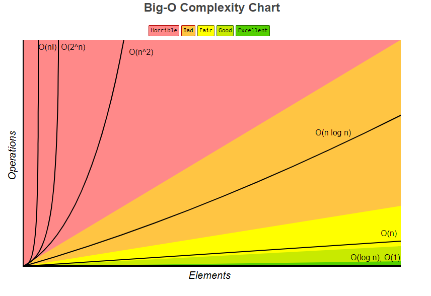
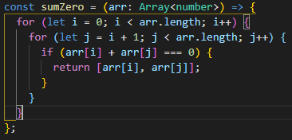

# algo-data-notes

A simple repo where I can store my notes on algorithms, data structures, bigO notation and examples

# Big O Notation

## Why is big O notation important?

- There are so many solutions for solving an algorithm, how do we know which one is the best? This is where Big O comes in.
- Take for example given the problem "write a function that accepts a string input and returns a reversed copy" you could use a variety of solutions for this, we would we use Big O notation to understand which is the best
- Keep in mind that the way Big O ranks how well a solution performs is not as straight forwrd as "worst - best" its more of a numeric approach.
- You may ask, why worry about the best solution if my code works? If it works, it works.
  - Its important to have precise vocabulary to talk about how our code performs.
  - Useful for discussing trade offs between different approaches.
  - Help understand what parts of our code that could be slowing it down.

## Example

-Write a function that calculates the sum of all number from 1 up to n

-Solution One

-Solution Two

- Here we have two working solutions so which one is better?
- Do we look at which is faster? Which uses less memory? Which is more readable? They are all valid concerns and it comes down to the situation.
- Idealy we would focus on speed and memory usage first.

- When testing the speed on both solutions, soluton 1 takes around 1.25 seconds to run while solution 2 takes .0001 seconds to run. A huge difference.
- The only problem is that when it comes to timing our code there is alot of problems with time in general
  - Different machines will record different times
  - The SAME machine will record different times
  - For algorithms where the solution is relatively fast for all solutions, speed measurements may not be precise enough.
- But how would we write down how effecient these solutions are in comparison?
  - Instead of measuring time, we would instead count the NUMBER of simple operations the computer has to perform.
  - This remains constant compared to measuring time.
- if we look at solution 2 we can see three operations happening.
  - 1 multiplication
  - 1 addition
  - 1 division

- If we use the same approach for solution one we will see x operations
  - since we are in a loop here the amount of operations is dependant on n.
  - within the loop we have n additions and n assignments (+=)
  - we have n additions and n assignments for incrementing i (i++)
  - 1 assignment for total variable, 1 assignment for i variable, n comparisons for i to n (i<= n)

- Dont get bogged down on counting all the operations and assignments, what we are concerned about here is how our operations grow roughly in proportion with n. It is a trend. Focus on the big picture.

## So what exactly is Big O?

- Think of it as fuzzy counting, it allows us to talk in a formal manner about how the runtime of an algorithm grows as the inputs grow.

  - we only care about the trends
  - we are also talking about the worst case scenario when it comes to a solution

- This graph is a great visual representation of different types of O notation, some have yet to be covered

- We say that an algorithm is O(f(n)) if the number of simple operations the computer has to perform is eventually less than a constant times f(n), as n increases. f = function & n = input
- if we take our previous examples
  - Example two always has 3 operations, its constant. It would have a runtime of O(1)

- If we look at example one
  - The number of operations is bounded by a multiple of n. It would have a runtime of O(n)

- Now if we look at the example of this function we notice that O(n) operation for the first for loop has another O(n) operation inside of it as another for loop so it would have a runtime of O(n^2) <=== squared. The algo grows roughly at the rate of n squared

## Rules for Big O

- Constants dont matter
  - if we have something like O(2n) this becomes O(n). If we have O(500) this becomes (1). O(13n2) becomes O(n^2) <=== squared
- Smaller terms dont matter
  - If we have something like O(n + 10) this becomes O(n)
  - If we have O(n^2 + 5n + 8) this becomes O(n^2). Look at the big picture if n = 1000; 1000 squared is 1 mil, but 5\*1000 + 8 is 5008. The difference between the two is so small there is no point in worrying about the 5n + 8, its meaningless.
- Arithmetic operations are constant
- Variable assignment is constant
- Accesing elements in an array or object is constant
- in a loop the compelxity is the length of the loop times the complexity of whatever happens inside the loop

## Logarithms

- Some of the most common runtime complexities youll encounter is O(1), O(n), and O(n^2)
- You will encounter big O expressions that involve more complex mathematical expressions
  - One of these being the logarithm such as O(logn)
- If you have a runtime complexity of O(log n) thats great! Very similar to O(1)
- It is helpful to understand what logarithms are but at the end of the day the math isnt as important because we are always focusing on the trend
  - the point is to be able to look at an algorithm and say "Oh this algo has a runtime of O(n)"
- Why logathrims are importnt
  - Certain searching algorithms have a logarithmic time complexity
  - Efficient sorting algorithms involve logarithms
  - Recursion sometimes involves logarithim space complexity

## Analyzing performance of Arrays and Objects

- We can understand how objects and arrays work through the lens of Big O

### Objects

- Objects are great when you dont need order and want fast access / insertion and removal
- runtime complexity for
  - accessing an object: O(1)
  - adding to an object: O(1)
  - removing from an object: O(1)

### Arrays

- Arrays are ordered unlike an object
- Should only really use them when you need order, and fast access for insertion and removal
- Accessing an array is O(1) its constant Ex. arr[0] / arr[9000]
- Insertion / Removal
  - Adding an element to the end of array with .push() is O(1)
  - Adding an element to the beginning of an array requires all indecis to update which is O(n)
    - Same goes for removing from the beginning
- Searching is O(n) as the number of items in a array grows the amount of time grows to search through the array

- There are some built in array methods
  - push(): O(1)
  - pop(): O(1)
  - shift(): O(n)
  - unshift(): O(n)
  - concat(): O(n)
  - slice(): O(n)
  - splice(): O(n)
  - sort(): O(n \* log n)
  - forEach(), map(), filter(), reduce(), etc..: O(n)

## Algorithms and Problem Solving Patterns

- OBJECTIVE
  - understand what an algorithm is
  - how to devise a plan to solve algorithms, even ones we are unfamiliar with
  - compare and contrast problem solving patterns

### What is an Algorithm?

- A proccess or set of steps to accomplish a certain task.
- Why is this important
  - almost everything you do in programming involves some form of an algorithm
  - understanding algorithms is the foundaiton for being a successful problem solver and developer
  - and of course they come up in interviews
- How do you improve?
  - Devise a plan for solving problems, how do you approach a problem and break it down?
  - Master common problem solving patterns

### Problem solving strategies

- Understand the problem

  - Don't rush into typing out your code, take a step back and analyze the problem
  - Ask these questions:
    - Can I restate the problem in my own words?
    - What are the inputs that go into the problem?
    - What are the outputs that should come from the solution to the problem?
    - Can the outputs be determined from the inputs?
    - How should I label the important pieces of data? What are the pieces that matter?

- Exploring Examples

  - Coming up with examples can help you understand the problem better
    - User Stories
    - Unit Test
    - explore simple examples, examples with empty inputs, invalid inputs

- Break it down

  - Write out the steps you need to take, just the basic components. This makes you think about your code before you write it and helps you catch or figure out any parts you might not understand
  - Remember that in an interview setting a lot of the time you will be given probelms that you aren't expected to solve within the given time, they are more concerened about how you approach solving problems.

- Solve / Simplify

  - Solve the problem if you can, and if you cant solve a simpler problem. Try to ignore the parts giving you a hard time so you can focus on everything else
  - After creating a simplified solution try to incorporate the difficult part

- Look Back and Refactor

  - Once you have a solution its tempting to leave the problem at that, if it works it works right?
  - It's important to try and improve your code, take the time to reflect on it. What do you not like about it?
    - is it easy to read and understand?
    - can you imrpove the performance of your solution?
    - can you thikn of ways to refactor?
    - how have other people solved this problem
  - There is rarely only one solution to solving a problem

### Problem Solving Patterns

- Common Patterns

  - Frequency Counter
  - Multiple Pointers
  - Sliding Window
  - Divide and Conquer
  - Dynamic Prgramming
  - Greedy Algo
  - Back Tracking

- Frequency Counter

  - This pattern uses objects or sets to collect values and their frequency
  - this is helpful for avoiding nested loops
  - Ex. Write a function called same which accepts two arrays. The function should return true if every value in the array has its coresponding value squared in the second array.
  - In short you can break down two arrays and store there values in seperate objects and compare

  - The approach seen below would have a complexity of O(n^2) due the fact that we have a nested loop(indexOf) within a forloop.

  

  - If we use the frequency counter approach our solution would something like the following:

  

  - we create two seperate frequency counters and initilize them as empty objects, storing the values from each array inside the object with how many times they occur.
  - if our inputs for the function were two arrays such as [1,2,2,3] and [1,4,4,9] our objects would look like
    - frequencyCounter1 = {1:1, 2:2, 3:1}
    - frequencyCounter2 = {1:1, 4:2, 9:1}
  - We can then compare the objects to see if the key values match
  - This approach would have a complexity of O(n) which is an improvment over O(n^2)
    - with the O(n^2) approach if our arrays had a length of 1000, since we have a nested loop that would be 1 million iterations
    - with the O(n) approach we have 3 seperate loops so if the array was a length of 1000 there would only be 3000 iterations

- Multiple Pointers

  - Creating pointers or values that correspond to an index or position and move towards the beginning, end or middle based on a certain condition
  - Very efficient for solving problems with minimal space complexity
  - Ex. write a function called sumZero which accepts a sorted array of integers. The funciton should find the first pair where the sum is 0. Return an array that includes both values that sum to zero or undefined if a pair does not exist.
  - The first solution that might come to mind could be nesting a for loop within a for loop, but as we know this would be a complexity of O(n^2) which is not ideal

  

  - For this example we know that are input of numbers is going to be in order which is necessary for using pointers.
  - We will set a pointer at the beginning of the array, the smallest number, and a pointer at the end of the array, the largest number.
  - If the sum is greater than 0 we will move the right pointer down 1, and if its less than 0 we will move the left pointer up 1. This is why its important to know that our array is sorted.
  - This solution will have a complexity of O(n) much better than O(n^2)

  

- Sliding Window Pattern

  - This pattern involves creating a window which can either be an array or number from one position to another
  - Depending on a certain condition, the window either increases or closes
  - very useful for keeping track of a subset of data in an array/string etc.
  - for example say given an array you wanted to calculate the maximum sum of 2 consecutive numbers, you could make a window and move the window across the array depending on the condition.

  

  - The problem with the solution seen above is the nested loop, leading to a complexity of O(n^2). If our array was extremely large and we were looking for the max sum of 100,000 digits this would be extremely inefficient.
  - If we were to refacor the solution and incorporate the sliding window, it would look something like this.

  

  - This solution allows up to loop over the array one time. We do this by storing the initial value of the summed digits and instead of repeating the process over and over we instead subtract the first number and add the new number. This solution would have a complexity of O(n)

- Divide and Conquer

  - This pattern involves dividing a data set into smaller chunks and then repeating a process with a subset of data. (Think of the phonebook example from CS50)
  - This pattern can greatly decrease time complexity.
  - Ex. Given a sorted array of integers, write a function called searh that accepts a value and returns the index of where that value is found.
  - In the solution below, we loop over the array until we find the number in the array that matches the given value, giving us a complexity of O(n), which is not terrible, but it could be better!

  

  - If we were to refactor our solution to use the divide and conquer method, in this case a binary search, it would look something like the following:

  

  - We start in the middle of the array and check if the number we are on is less then or greater then the value we are searching for and move in accordance.
  - This has a complexity of Log(n)
  - Keep in mind for this method to work our array must be sorted.

## Recursion

- Recursion is another way to think about writing a solution.
- To help understand recursion, we shall tell a story:
  - Once upon a time there was a little boy named Martin, this was during a time where computers didnt exist and instead we had wizards. Martin was training with the wizards and out in the world there was also an angry dragon. The wizard gave martin a task to talk to the dragon, he gave Martin a list of numbers and wanted Martin to find out if any of the numbers on the list were odd numbers, a task only the dragon could complete.
  - So Martin approached the dragon and said "Excuse me Mr.Dragon, are any of these numbers odd? (3142, 5798, 6550, 5914)"
  - The dragon is not in a good mood, and says "Sorry boy, ill only tell you if the first number in that list is odd"
  - Martin replies "BUT I NEED TO KNOW IF ANY OF THE NUMBERS IN THE LIST ARE ODD NOT JUST THE FIRST"
  - The dragon remains firm and stands his ground. So martin think a bit an what he could do and comes up with a solution. Being the clever apprentice to the wizard Martin approaches the dragon and says "Alright is this number odd?" (3142, 5798, 6550, 5914) and gives him the original list. The dragon looks at the first number in the list and gives his answer. Martin then returns and says "Okay is this number odd?" giving him this list (5798, 6550, 5914) and repeats this process until going through all the numbers individually, through this process he discovers that none of the numbers are odd.
  - Feeling triumphant Martin exclaims to the dragon "AHA so you're saying none of the numbers in the original list are odd!"
  - The dragon tilts his head to the side with a curious look on his face and replies "Ah, I see my boy. So you've dicovered recursion?"

### So why use recursion?
